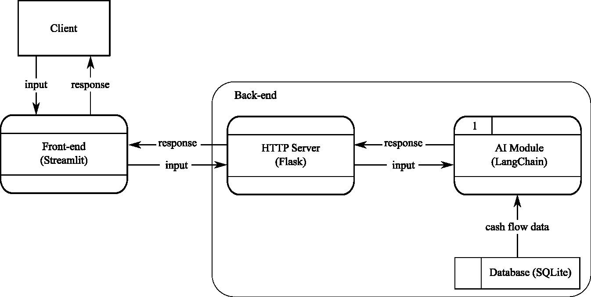

# Cash Flow Assistant
Requirement: Building a system to provide insights and information to external users in a natural language conversation format. The context revolves around querying numerical information as we have a table T containing the cashflow data for some clients.

[For developer technical development click here](README_developer.md)

## About the data
For simplity, the database only have one table for storing the following fields:
| Field      | Description |
| ----------- | ----------- |
 |Store_ID | The unique identifier for each store 
 | Store_Address | The physical address or location of each store |
 | State | The state of each store. |
 | Company | The name of the company that owns the stores |
 | Company_ID | The unique identifier for the company associated with each store |
 | Revenue | The income generated by each store |
 | Expenses | The costs incurred by the store |
 | Date | The date where the data is recorded |
 | Client_ID | The unique identifier of the client | 
 
There are two clients in this mock database. Client 1 and Client 2. Client 1 has access to the cash flow data of Coles and Woolworths, whereas Client 2 has access to the cash flow data of Kmart and Aldi.

## System Architecture Overview
 

## Core Functionalities of the System
- QA Module: Answer general queries abou the system
- Data Module: Query the cash flow data based on the client's input
- Forecast Module: Forecast future cash flow data based on the client's input
- Switch Module: Determine the appropriate module for the the client's input.

## Examples of the client input:
- How much income did I get last month?
- How much did I spend in Apr-2023?
- How will my cashflow look like in the next three months?
- What can you help me with?